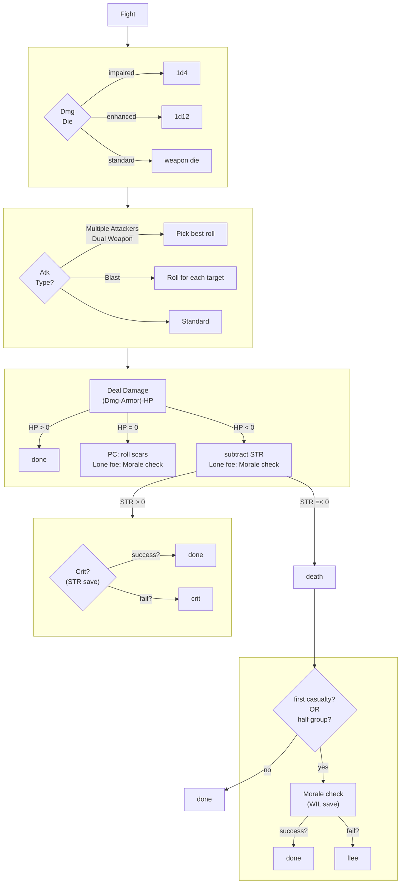

# Combat Flowchart

```mermaid
flowchart TD
    E[Fight] --> one
    subgraph one [" "]
    G{Dmg<br>Die}
    G -->|impaired| H[1d4]
    G -->|enhanced| I[1d12]
    G -->|standard| L[weapon die]
    end
    one --> two
    subgraph two  [" "]
    M{Atk<br>Type?}
    M -->|Multiple Attackers<br>Dual Weapon| N[Pick best roll]
    M -->|Blast| P[Roll for each target]
    M -->Q[Standard]
    end
    subgraph three [" "]
    R["Deal Damage<br>#40;Dmg-Armor#41;-HP"]
    R --> |HP > 0| S[done]
    R --> |HP = 0| T[PC: roll scars<br>Lone foe: Morale check]
    R --> |HP < 0| U[subtract STR<br>Lone foe: Morale check]
    end
    two --> three
    subgraph four [" "]
    W{"Crit?<br>#40;STR save#41;"}
    W --> |success?| 1["done"]
    W --> |fail?| 2["crit"]
    end
    U --> |STR > 0| four
    U --> |STR =< 0| Z[death]
    Z --> 3{first casualty?<br>OR<br>half group?}
    subgraph five [" "]
    3 --> |yes| 4["Morale check<br>#40;WIL save#41;"]
    4 --> |success?| 6["done"]
    4 --> |fail?| 7["flee"]
    end
    3 --> |no| 5[done]
 classDef default text-align:center
```

  
  
